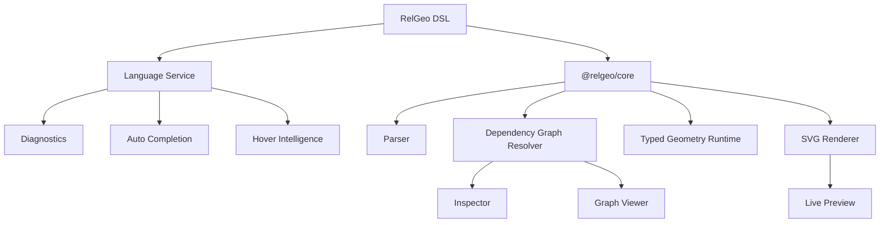

# RelGeo Playground

The official lightweight interactive IDE for RelGeo.

## Versioning

The Playground package metadata version is currently `0.4.0`, while the documents it edits and inspects follow the active RelGeo DSL contract `v0.5`. These version numbers are intentionally separate: the package number describes the application package, and `v0.5` describes the language contract.

For package-owned docs that should grow closer to this package over time, see `docs/README.md`.

## Quick Start

The Playground is a private workspace application. Run it locally from the repository root:

```bash
pnpm install --frozen-lockfile
pnpm dev
```

Open the URL printed by Vite, normally [`http://localhost:5173/playground/`](http://localhost:5173/playground/).

To use a fixed local address instead:

```bash
pnpm dev --host 127.0.0.1 --port 4335
```

Then open [`http://127.0.0.1:4335/playground/`](http://127.0.0.1:4335/playground/). Stop the server with `Ctrl+C`.

Run the automated browser smoke locally after installing the Chromium runtime once:

```bash
pnpm exec playwright install chromium
pnpm test:e2e
```

The smoke covers the source-to-preview diagnostic flow and the mobile `Both`, `Source`, and `Preview` surface switcher. The workspace integration gate installs Chromium automatically when it runs this check in CI.

Pada repo aktif saat ini, Playground ini ditujukan untuk mengedit dan memeriksa dokumen `RelGeo DSL v0.5`.

Status packaging saat ini:

* package ini adalah aplikasi workspace
* package ini bersifat `private` dan bukan target publish registry
* ia berfungsi sebagai lightweight browser IDE untuk authoring, preview, dan inspection cepat

Pakai package ini jika Anda ingin:

* mencoba authoring RelGeo secara interaktif
* memeriksa preview, dependency graph, dan inspector geometry
* mendemokan workflow edit -> resolve -> preview tanpa membangun UI sendiri

Jika yang Anda butuhkan berbeda:

* gunakan `@relgeo/cli` untuk workflow terminal
* gunakan `@relgeo/core` + `@relgeo/renderer-svg` untuk integrasi kustom
* gunakan Flutter workbench untuk workspace lokal yang lebih kaya

`relgeo-playground` is a lightweight geometry IDE designed for:

* authoring relation-first vector drawings as text
* inspecting runtime geometry
* debugging dependency graphs
* experimenting with reusable parametric drawing rules

It combines:

* the `@relgeo/core` typed geometry runtime
* the `@relgeo/language-service`
* a live SVG drafting environment

into a single interactive workspace.

Catatan positioning yang penting:

* `relgeo-playground` sengaja dijaga lebih ringan daripada workbench Flutter
* ia diposisikan untuk loop `edit -> resolve -> preview -> inspect`
* ia bukan personalized desktop-style workspace dengan preference system yang kaya
* state lokal yang dipertahankan sengaja dijaga tetap minimum

---

# Philosophy

RelGeo Playground is not designed as a generic SVG editor.

Instead, it is built around the idea of:

```txt
text-native relation-first drawing authoring
```

The goal is to help users:

* construct geometry semantically
* inspect geometric relations visually
* preserve design intent
* debug dependency-driven geometry systems
* work with drawings as editable, reviewable source

Technical drawing is an important first domain for this Playground, but it is not the only conceptual target.

The broader goal is to support authoring workflows where:

* drawings are written as source
* geometry remains self-documenting
* one drawing rule can produce multiple variants through changing inputs

Playground ini juga tidak ditujukan untuk meniru semua capability UX dari workbench Flutter.

Secara sengaja:

* Playground memprioritaskan kecepatan buka, kecepatan edit, dan kemudahan share
* Flutter workbench boleh membawa UX preference yang lebih kaya dan lebih menetap

Dengan kata lain:

```txt
Playground = lightweight browser IDE
Flutter    = richer local workbench
```

---

# Architecture



---

# Features

## Intelligent RelGeo Editor

Powered by:

* CodeMirror 6
* RelGeo Language Service

Features include:

* context-aware autocomplete
* hover documentation
* live diagnostics
* geometry-aware validation
* semantic suggestions
* object-aware completion

The editor understands:

* geometry primitives
* ellipse primitives and closed-shape queries
* split on open path-like targets
* anchors
* path segments
* intersections
* tangent queries
* frame queries
* path-length queries
* derived geometry properties

---

## Live Geometry Preview

The preview panel renders the resolved geometry scene in real time using SVG.

Features:

* live rendering
* auto-fit viewport
* zoom & pan
* responsive scaling
* scene-first model preview for authoring and inspection
* optional print-oriented sheet/view preview mode
* stale-preview recovery during temporary compile errors
* direct session toggles without heavy preference management

Catatan semantik yang penting:

* preview utama playground harus dibaca pertama-tama sebagai `model preview`
* angka zoom UI adalah zoom viewport layar, bukan skala fisik dokumen
* keterbacaan garis default di layar adalah urusan display policy preview
* mode preview sheet/view yang berorientasi print adalah surface berbeda dengan aturan baca berbeda
* surface print-oriented tidak mengubah identitas utama playground sebagai lightweight browser IDE untuk authoring dan inspection
* selama playground masih memakai satu panel preview, perpindahan ke `sheet/view` harus dipahami sebagai perpindahan jalur baca, bukan sekadar toggle visual biasa
* dokumen yang memiliki `sheets` tetap wajar dibuka pertama kali di `model preview`; affordance menuju jalur print-oriented harus jelas, tetapi tidak perlu mengubah default itu
* saat dokumen punya `sheets` dan pengguna masih berada di `model preview`, playground kini boleh memberi CTA ringan untuk membuka `Sheet/View` pertama tanpa memaksa auto-switch

---

## IDE Overlay System

The Playground includes geometry inspection overlays:

* anchors
* bounding boxes
* labels
* segment indices

These overlays help users inspect:

* geometric relationships
* path topology
* construction logic
* runtime placement behavior

---

## Parametric Controls

Parameters can be adjusted interactively through sliders.

This allows:

* real-time geometry exploration
* rapid iteration
* interactive profile switching
* reusable rule testing across input variants

Profiles remain an interactive convenience for swapping many parameter values at once.
Internal runtime resolution still works from the final parameter values themselves.
In the Playground UI, this surface is best understood as `Parameter Profiles`.

---

## Metadata Presets Reference

The Playground can also show document-defined metadata bundles through a read-only sidebar panel.

This panel is intended for:

* inspecting reusable `meta` bundles
* understanding object presentation presets used by the current document
* tracing authoring shorthand without turning it into an interactive control

Unlike Parameter Profiles:

* Metadata Presets do not override parameters
* Metadata Presets do not act as a runtime toggle in the Playground
* Metadata Presets are a document authoring convenience, not an interactive preview control

---

## Inspector Panel

The Inspector exposes runtime geometry information directly from the typed geometry runtime.

Examples:

* object type
* resolved coordinates
* path length
* area
* resolved metadata role/intent/preset clues
* segment information
* holes
* bounding values
* derived properties

---

## Dependency Graph Viewer

RelGeo Playground includes a deterministic dependency graph viewer.

Features:

* object dependency visualization
* runtime graph inspection
* cycle debugging
* object selection integration

The graph viewer is implemented using native SVG rendering and does not depend on Mermaid.

---

## Flexible Workspace Layout

The Playground supports:

* horizontal split
* vertical split
* editor-only mode
* preview-only mode
* resizable panels
* movable sidebar
* collapsible inspector

The layout system is optimized for drafting workflows rather than generic IDE replication.

It is intentionally kept lighter than the Flutter workbench:

* enough layout flexibility for editing and inspection
* without growing into a full persistent workspace preference system

---

## Runtime Worker Isolation

Geometry resolution runs inside a dedicated Web Worker.

This ensures:

* responsive typing
* non-blocking geometry recomputation
* scalable drafting sessions
* safer runtime isolation

---

## Shareable Documents

Documents can be shared through URL state encoding.

This allows:

* reproducible examples
* embedded demos
* shareable bug reports
* lightweight publishing workflows

---

# Example

```yaml
objects:
  panel:
    type: rect
    size: [120, 80]

  display:
    type: rect
    size: [50, 20]
    place:
      centerX: panel.centerX
      top: panel.top + 15

  knob:
    type: circle
    radius: 8
    place:
      centerX: panel.centerX
      bottom: panel.bottom - 20
```

---

# Getting Started

## Prerequisites

Install Node.js and pnpm. The expected package manager version is recorded in [`package.json`](./package.json).

## Install Dependencies

For reproducible installs, use the lockfile:

```bash
pnpm install --frozen-lockfile
```

Use `pnpm install` when intentionally updating dependencies and the lockfile.

## Development Server

```bash
pnpm dev
```

Vite prints the local URL in the terminal. Because the application is served under the `/playground/` base path, open the URL with that path appended, normally:

```text
http://localhost:5173/playground/
```

For a fixed host and port:

```bash
pnpm dev --host 127.0.0.1 --port 4335
```

Open:

```text
http://127.0.0.1:4335/playground/
```

## Quality Checks

Run the checks before committing changes:

```bash
pnpm audit:ux
pnpm lint
pnpm test
pnpm build
```

## Preview the Production Build

```bash
pnpm build
pnpm preview
```

Open the preview URL printed by Vite, using the `/playground/` path. The default preview port is usually `4173`.

---

# Workspace Relationship

The Playground is part of the RelGeo ecosystem:

* `@relgeo/core`
  → typed geometry runtime

* `@relgeo/language-service`
  → editor intelligence layer

* `relgeo-playground`
  → interactive drafting environment

---

# Future Direction

The Playground is designed to evolve toward:

* embeddable playground mode
* markdown embedding
* live documentation blocks
* runtime graph inspection
* geometry debugging tools
* collaborative drafting
* incremental recomputation

Guard rails for that evolution:

* keep Playground lightweight and browser-friendly
* avoid copying the full workbench preference model from Flutter unless there is strong evidence it improves the main editing loop
* prefer task-centric improvements over preference-centric complexity

---

# Positioning

RelGeo Playground sits somewhere between:

```txt
CAD Workbench
+
Geometry Runtime Inspector
+
Technical Drafting IDE
```

while intentionally remaining:

* lightweight
* deterministic
* relation-first
* completion-oriented

More precisely, "lightweight" here means:

* minimal persistence
* minimal UX preference state
* fast onboarding and reproducibility
* quick shareable editing sessions

---

# License

MIT. See [`LICENSE`](./LICENSE).
