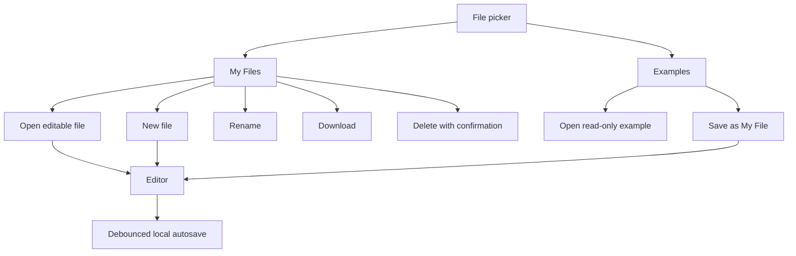
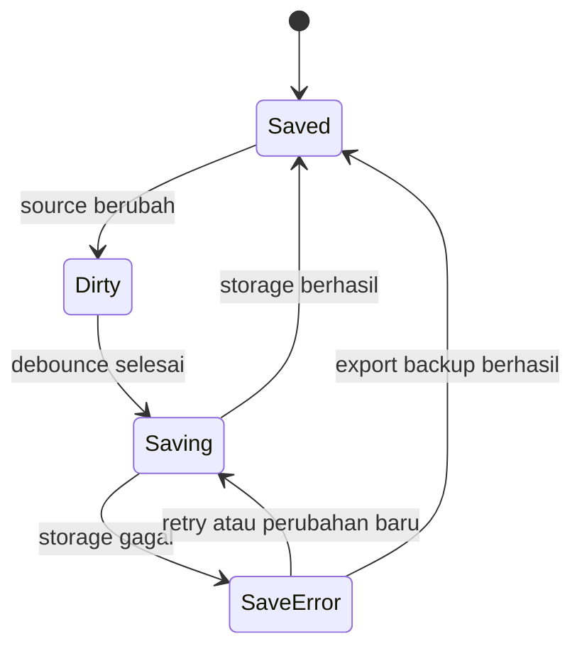

# Sub-Rencana 10 — Playground Local File Workspace

**Status:** direncanakan, belum diimplementasikan  
**Pemilik implementasi:** `relgeo/playground`  
**Pemilik keputusan:** Agus Made  
**Compatibility line:** RelGeo DSL 0.5.x  
**Tujuan:** mengubah Playground dari pemilih example menjadi lightweight browser IDE dengan workspace file lokal yang aman, jelas, dan dapat dipulihkan.

## 1. Keputusan utama

Playground tetap menjadi satu aplikasi dan tetap berada di repository `relgeo/playground`. Web app/PWA bukan repository baru pada tahap ini. PWA adalah delivery surface dari aplikasi yang sama, sedangkan fitur yang direncanakan di sini adalah kemampuan authoring dan persistence lokal.

Kita tidak membangun sistem akun, backend, sinkronisasi cloud, kolaborasi, atau project management. Semua file pengguna pada tahap ini bersifat lokal pada origin browser Playground.

## 2. Masalah yang diselesaikan

Playground saat ini sudah memiliki lightweight persistence untuk draft aktif, tetapi modelnya masih berpusat pada satu draft dan daftar example bawaan. Pengguna membutuhkan model yang lebih jelas:

- membuat file baru dengan nama;
- menyimpan beberapa file pribadi;
- kembali membuka file yang pernah dibuat;
- mengganti nama, mengunduh, mengimpor, dan menghapus file;
- tetap dapat memakai example bawaan tanpa mengubah sumber aslinya;
- mengetahui kapan perubahan sudah tersimpan secara lokal.

## 3. Boundary produk

### Termasuk

- daftar **My Files** di atas daftar **Examples**;
- file baru dari template kosong atau starter template;
- rename, duplicate, delete, import, dan download;
- autosave ke storage browser;
- active file dan restore setelah reload;
- dirty/saving/saved/error state;
- validasi nama, ekstensi, ukuran, dan quota;
- migrasi schema persistence;
- backup dan restore seluruh workspace pada tahap lanjutan.

### Tidak termasuk pada tahap ini

- folder dan nested project;
- akun pengguna atau login;
- cloud sync;
- kolaborasi realtime;
- server-side file storage;
- perubahan langsung terhadap example bawaan;
- penggantian Playground menjadi workbench desktop penuh.

## 4. Model mental pengguna

Pengguna melihat dua sumber file yang berbeda:

1. **My Files** — file yang dimiliki dan dapat diubah pengguna.
2. **Examples** — materi bawaan aplikasi yang read-only dan dapat disalin.

Saat example dibuka, aplikasi harus mempertahankan identitasnya sebagai example. Jika pengguna mulai mengeditnya, tersedia aksi **Save as My File** atau alur otomatis yang membuat salinan pribadi dengan nama yang aman. Example asli tidak pernah ditimpa.



## 5. Data model yang direkomendasikan

Tahap pertama memakai model dokumen, bukan model project. Project/folder dapat ditambahkan kemudian tanpa mengubah konsep dasar file.

```ts
type LocalDocument = {
  id: string;
  name: string;
  content: string;
  createdAt: number;
  updatedAt: number;
  source: 'new' | 'imported' | 'example-copy';
  originExampleKey?: string;
};

type LocalWorkspace = {
  schemaVersion: 1;
  activeDocumentId: string | null;
  documents: LocalDocument[];
};
```

Ketentuan:

- `id` stabil dan tidak berasal dari nama file;
- `name` disimpan tanpa harus memiliki ekstensi di UI, tetapi download default memakai `.yaml`;
- `updatedAt` menentukan urutan recent files;
- `source` membantu UI menjelaskan asal file;
- `originExampleKey` hanya metadata provenance, bukan ketergantungan runtime;
- content adalah source RelGeo, bukan hasil SVG atau resolved scene;
- schema version wajib disimpan agar format dapat dimigrasikan.

## 6. Storage dan durability

### Keputusan awal

Gunakan `localStorage` terlebih dahulu karena file berupa teks, jumlah file diperkirakan kecil, dan pengguna secara eksplisit menginginkan penyimpanan lokal sederhana. Bungkus aksesnya dalam repository/module persistence yang teruji; jangan menyebarkan pemanggilan `localStorage` ke komponen UI.

### Guardrail

- gunakan satu key ber-version, misalnya `relgeo_playground_workspace_v1`;
- tulis dengan debounce sekitar 300–500 ms setelah perubahan source;
- tangani `QuotaExceededError` dan storage yang tidak tersedia;
- jangan menyimpan `dist`, SVG, cache resolver, atau state inspector;
- lakukan migrasi dari `DRAFT_STORAGE_KEY` lama;
- jika migrasi gagal, pertahankan draft lama dan tampilkan recovery message;
- sediakan export backup sebelum storage diperluas;
- dokumentasikan bahwa clear-site-data/browser reset dapat menghapus file.

IndexedDB baru dipertimbangkan jika jumlah file, ukuran source, metadata, atau kebutuhan attachment membuat batas `localStorage` terasa nyata. Pergantian storage harus tetap memakai model `LocalWorkspace` yang sama.

## 7. UX dan perilaku fitur

### 7.1 File picker

- tampilkan **My Files** di atas **Examples**;
- tampilkan nama, status aktif, dan waktu perubahan secara ringkas;
- file aktif mempunyai state visual dan accessible name;
- empty state My Files menawarkan **New file** dan **Import file**;
- example diberi penanda read-only;
- sediakan search hanya bila jumlah file mulai mengganggu scanability.

### 7.2 New file

- default name: `Untitled 1`, lalu naik jika bentrok;
- gunakan starter source valid agar preview pertama tidak langsung error;
- fokus berpindah ke nama atau editor secara konsisten;
- file langsung masuk ke My Files dan disimpan.

### 7.3 Rename

- rename inline atau melalui menu file;
- nama kosong, whitespace-only, dan nama duplikat ditolak atau dinormalisasi dengan pesan jelas;
- rename tidak mengubah `id` atau isi source;
- nama download menggunakan nama yang sudah dinormalisasi.

### 7.4 Autosave

State minimum:



UI harus membedakan `Saving…`, `Saved locally`, dan `Could not save locally`. Autosave tidak boleh mengganggu cursor, selection, resolve worker, atau focus editor.

### 7.5 Delete

- hanya berlaku untuk My Files;
- gunakan confirmation dialog untuk file berisi source;
- jangan menghapus file dari storage sebelum konfirmasi;
- setelah penghapusan, buka file terakhir yang valid atau starter file;
- jangan pernah menyediakan delete untuk example bawaan.

### 7.6 Import dan download

Import tahap awal:

- menerima `.yaml` dan `.yml`;
- membaca sebagai text;
- memakai basename sebagai nama awal;
- menormalkan bentrok nama tanpa menimpa file lama;
- menolak file terlalu besar dengan pesan actionable;
- membuat dokumen baru, bukan mengganti file aktif secara diam-diam.

Download tahap awal:

- mengunduh source aktif, bukan hasil SVG;
- memakai nama file aktif dengan ekstensi `.yaml`;
- tetap tersedia ketika resolve sedang error;
- memberikan feedback sukses/gagal.

Drag-and-drop dapat ditambahkan setelah input file biasa stabil.

### 7.7 Share URL

Source dari hash share adalah dokumen sementara sampai pengguna memilih **Save to My Files**. Membuka share URL tidak boleh menimpa file lokal aktif tanpa konfirmasi. Jika hash terlalu panjang atau invalid, tampilkan recovery state yang berbeda dari error parser.

### 7.8 Backup workspace

Backup seluruh workspace direkomendasikan sebagai tahap lanjutan. Format awal dapat berupa JSON versioned yang memuat dokumen dan metadata, tetapi tidak memuat credential, browser state, atau hasil build. Restore harus preview/validate sebelum commit ke storage aktif.

## 8. Urutan implementasi

### Tahap A — persistence foundation

- [ ] definisikan `LocalWorkspace` dan schema version;
- [ ] buat pure functions untuk load, save, migrate, normalize, dan select;
- [ ] migrasikan single draft lama tanpa kehilangan source;
- [ ] tambahkan unit test untuk reload, malformed data, quota/storage error, dan migration.

**Exit gate:** state file dapat dimuat dan disimpan tanpa bergantung pada komponen React.

### Tahap B — My Files dan active document

- [ ] tambahkan active document state;
- [ ] tampilkan My Files di atas Examples;
- [ ] buat new file, open file, dan Save as My File;
- [ ] jaga example tetap read-only;
- [ ] tambahkan keyboard navigation dan accessible names.

**Exit gate:** pengguna dapat membuat dua file, berpindah di antaranya, reload, dan kembali ke file yang benar.

### Tahap C — editing lifecycle

- [ ] autosave debounce;
- [ ] saved/dirty/error status;
- [ ] rename;
- [ ] delete dengan konfirmasi;
- [ ] recovery ketika file aktif rusak atau storage gagal.

**Exit gate:** perubahan tidak hilang pada reload dan kegagalan storage dapat dipahami serta dipulihkan.

### Tahap D — file exchange

- [ ] import `.yaml`/`.yml`;
- [ ] download `.yaml`;
- [ ] nama, ekstensi, bentrok, dan ukuran tervalidasi;
- [ ] feedback aksi dan test browser untuk alur utama.

**Exit gate:** file dapat keluar-masuk Playground tanpa copy-paste manual.

### Tahap E — backup dan hardening

- [ ] export/import seluruh workspace;
- [ ] share URL menjadi transient document;
- [ ] migration test antar-schema;
- [ ] E2E untuk clear/reload/recovery;
- [ ] ukur quota dan putuskan apakah IndexedDB diperlukan.

**Exit gate:** local file workflow memiliki jalur backup dan tidak membuat klaim persistence yang lebih kuat daripada kemampuan browser.

## 9. Acceptance matrix

| Area | Bukti minimal |
| --- | --- |
| New file | file baru bernama, valid, dan muncul di My Files |
| Multiple files | dua file dapat dibuka bergantian tanpa isi tertukar |
| Autosave | reload mempertahankan perubahan terakhir yang berhasil disimpan |
| Rename | nama berubah tanpa mengubah id atau source |
| Delete | konfirmasi tampil dan file benar-benar hilang setelah setuju |
| Example safety | example asli tetap tidak berubah setelah diedit/disalin |
| Import | YAML valid dapat dibuka sebagai dokumen baru |
| Download | source aktif terunduh sebagai `.yaml` |
| Storage failure | error terlihat, source aktif tetap aman di memori, ada jalur retry/backup |
| Share | hash source tidak menimpa file lokal secara diam-diam |
| Accessibility | file list, menu, dialog, dan status dapat digunakan dengan keyboard dan memiliki nama/state semantic |
| Regression | unit, lint, build, dan E2E Playground tetap lulus |

## 10. Risiko dan keputusan yang ditunda

| Risiko/pertanyaan | Keputusan awal |
| --- | --- |
| localStorage quota | tangani error sekarang; evaluasi IndexedDB kemudian |
| folder/project | tunda sampai ada kebutuhan nyata |
| drag-and-drop | setelah file input biasa stabil |
| cloud sync | di luar scope dan membutuhkan keputusan produk baru |
| edit example langsung | tidak diperbolehkan; gunakan Save as My File |
| format backup | versioned JSON pada tahap lanjutan |
| PWA offline | delivery concern; tidak mengubah model file lokal |

## 11. Relasi dengan dokumen lain

- Audit UX/UI utama: [`UX-UI-AUDIT-AND-PLAN.md`](./UX-UI-AUDIT-AND-PLAN.md)
- Dokumentasi package: [`README.md`](./README.md)
- Master plan lintas-repo: [RelGeo Maturation Master Plan](https://github.com/relgeo/workspace/blob/main/docs/MATURATION-MASTER-PLAN.md)

Dokumen ini adalah rencana implementasi. Setelah setiap tahap selesai, status checklist, bukti test, commit child repository, dan pointer submodule workspace harus diperbarui.
