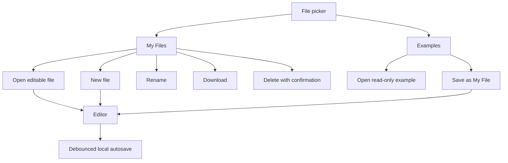
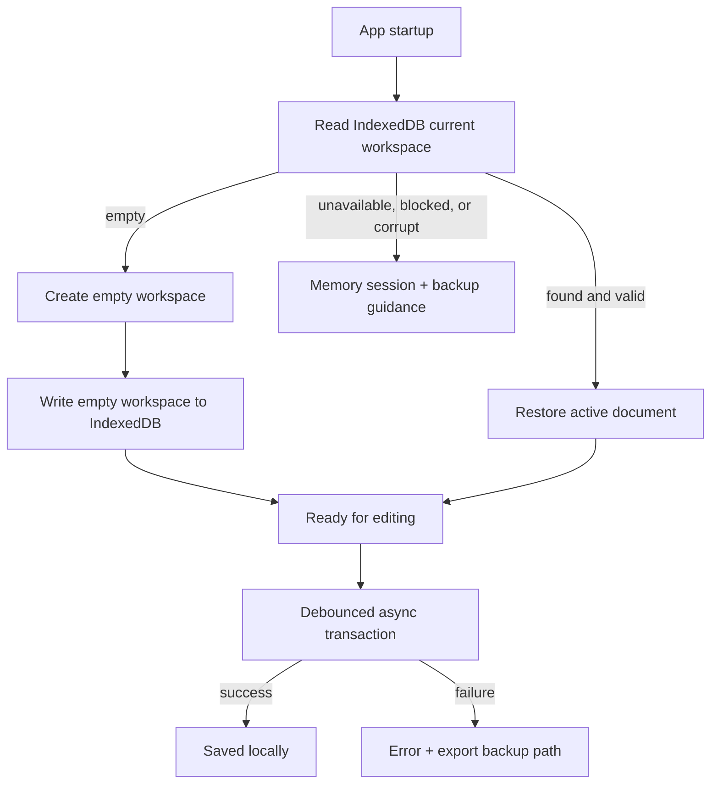
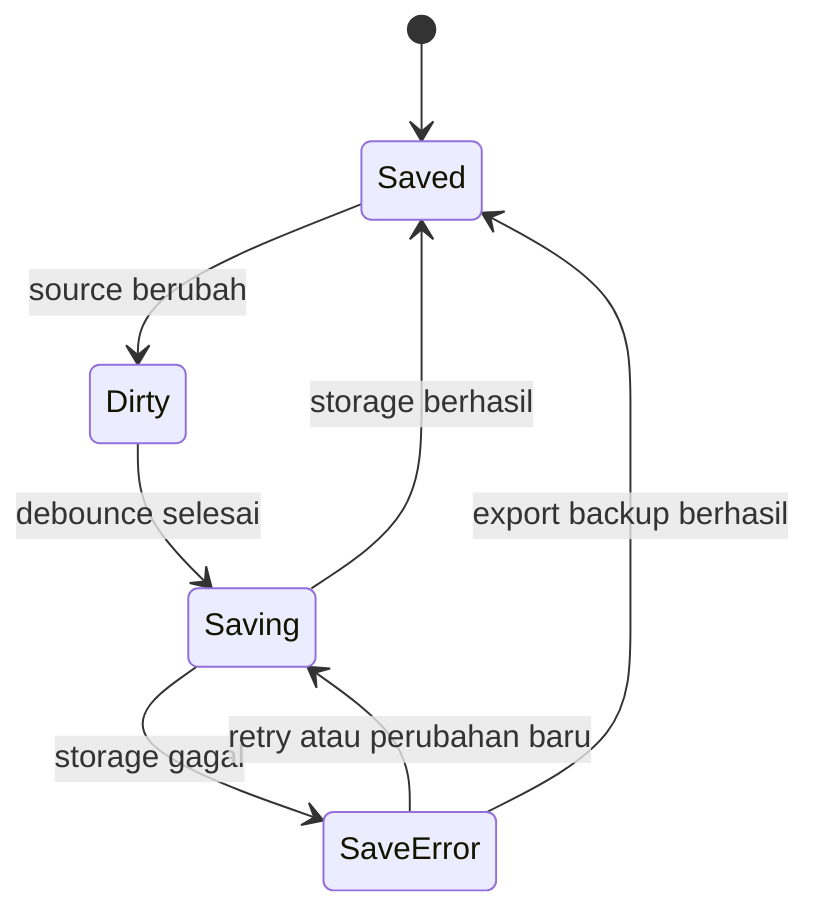

# Playground Local File Workspace Plan

**Status:** berjalan — Tahap A–F implementasi inti selesai; Playground memakai kebijakan fresh-start IndexedDB tanpa backward compatibility localStorage
**Pemilik implementasi:** `relgeo/playground`  
**Pemilik keputusan:** Agus Made  
**Compatibility line:** RelGeo DSL 0.5.x  
**Tujuan:** mengubah Playground dari pemilih example menjadi lightweight browser IDE dengan workspace file lokal yang aman, jelas, dan dapat dipulihkan.

## 1. Keputusan utama

Playground tetap menjadi satu aplikasi dan tetap berada di repository `relgeo/playground`. Web app/PWA bukan repository baru pada tahap ini. PWA adalah delivery surface dari aplikasi yang sama, sedangkan fitur yang direncanakan di sini adalah kemampuan authoring dan persistence lokal.

Kita tidak membangun sistem akun, backend, sinkronisasi cloud, kolaborasi, atau project management. Semua file pengguna pada tahap ini bersifat lokal pada origin browser Playground.

## 2. Masalah yang diselesaikan

Playground saat ini sudah memiliki lightweight persistence untuk draft aktif, tetapi modelnya masih berpusat pada satu draft dan daftar example bawaan. Pengguna membutuhkan model yang lebih jelas:

- membuat file baru dengan nama;
- menyimpan beberapa file pribadi;
- kembali membuka file yang pernah dibuat;
- mengganti nama, mengunduh, mengimpor, dan menghapus file;
- tetap dapat memakai example bawaan tanpa mengubah sumber aslinya;
- mengetahui kapan perubahan sudah tersimpan secara lokal.

## 3. Boundary produk

### Termasuk

- daftar **My Files** di atas daftar **Examples**;
- file baru dari template kosong atau starter template;
- rename, duplicate, delete, import, dan download;
- autosave ke storage browser;
- active file dan restore setelah reload;
- dirty/saving/saved/error state;
- validasi nama, ekstensi, ukuran, dan quota;
- validasi schema persistence;
- backup dan restore seluruh workspace pada tahap lanjutan.

### Tidak termasuk pada tahap ini

- folder dan nested project;
- akun pengguna atau login;
- cloud sync;
- kolaborasi realtime;
- server-side file storage;
- perubahan langsung terhadap example bawaan;
- penggantian Playground menjadi workbench desktop penuh.

## 4. Model mental pengguna

Pengguna melihat dua sumber file yang berbeda:

1. **My Files** — file yang dimiliki dan dapat diubah pengguna.
2. **Examples** — materi bawaan aplikasi yang read-only dan dapat disalin.

Saat example dibuka, aplikasi harus mempertahankan identitasnya sebagai example. Jika pengguna mulai mengeditnya, tersedia aksi **Save as My File** atau alur otomatis yang membuat salinan pribadi dengan nama yang aman. Example asli tidak pernah ditimpa.



## 5. Data model yang direkomendasikan

Tahap pertama memakai model dokumen, bukan model project. Project/folder dapat ditambahkan kemudian tanpa mengubah konsep dasar file.

```ts
type LocalDocument = {
  id: string;
  name: string;
  content: string;
  createdAt: number;
  updatedAt: number;
  source: 'new' | 'imported' | 'example-copy';
  originExampleKey?: string;
};

type LocalWorkspace = {
  schemaVersion: 1;
  activeDocumentId: string | null;
  documents: LocalDocument[];
};
```

Ketentuan:

- `id` stabil dan tidak berasal dari nama file;
- `name` disimpan tanpa harus memiliki ekstensi di UI, tetapi download default memakai `.yaml`;
- `updatedAt` menentukan urutan recent files;
- `source` membantu UI menjelaskan asal file;
- `originExampleKey` hanya metadata provenance, bukan ketergantungan runtime;
- content adalah source RelGeo, bukan hasil SVG atau resolved scene;
- schema version wajib disimpan agar format dapat dimigrasikan.

## 6. Storage dan durability

### Keputusan final

Gunakan **IndexedDB sebagai satu-satunya storage canonical** untuk workspace Playground. Karena Playground belum dipakai secara luas, instalasi baru dimulai dari workspace kosong dan data persistence lama di `localStorage` sengaja diabaikan. Tidak ada jalur migrasi, cleanup, atau penulisan balik ke `localStorage`.

Pengguna yang ingin memindahkan data harus memakai Backup/Restore JSON setelah fitur ini tersedia. Ini membuat kontrak persistence lebih kecil, lebih mudah diuji, dan tidak membawa asumsi kompatibilitas sebelum adopsi publik.

Alasannya:

- file pengguna adalah dokumen teks yang dapat bertambah jumlah dan ukurannya;
- IndexedDB bersifat asynchronous sehingga tidak memblokir UI saat autosave;
- transaksi object store lebih tepat untuk restore, replace, dan pengembangan folder/metadata;
- model `LocalWorkspace` tetap dipertahankan sehingga migrasi tidak mengubah kontrak UI;
- backup JSON tetap menjadi jalur portabel dan pemulihan utama.

### Kontrak database

- database: `relgeo-playground`;
- database version awal: `1`;
- object store: `workspaces`;
- record key: `current`;
- record value: `{ schemaVersion: 1, activeDocumentId, documents }`;
- semua akses dibungkus repository asynchronous; komponen React tidak memanggil IndexedDB langsung;
- debounce autosave tetap sekitar 300–500 ms, tetapi status UI mengikuti lifecycle transaksi asynchronous.



### Startup dan fallback

- pada startup, baca IndexedDB terlebih dahulu;
- jika record `current` belum ada, buat workspace kosong lalu tulis ke IndexedDB secara transactional;
- data `localStorage` pra-adopsi tidak dibaca dan tidak dihapus oleh aplikasi;
- jika inisialisasi IndexedDB gagal, tampilkan recovery message dan izinkan download backup untuk sesi memory-only;
- jika IndexedDB tidak tersedia atau diblokir, gunakan memory-only session dengan status error yang jujur; jangan diam-diam mengklaim persistence durable;
- backup restore harus menulis satu replacement transaction, lalu read-back dan validasi sebelum UI menganggapnya tersimpan;
- clear-site-data/browser reset tetap tidak dapat dipulihkan otomatis tanpa backup eksternal.

### Guardrail

- jangan menyimpan `dist`, SVG, cache resolver, atau state inspector;
- tangani `QuotaExceededError`, blocked upgrade, transaction abort, private-mode restrictions, dan storage unavailable;
- gunakan `navigator.storage.estimate()` bila tersedia untuk observability, bukan sebagai jaminan quota;
- `navigator.storage.persist()` boleh dievaluasi kemudian, tetapi bukan syarat baseline;
- pertahankan schema version pada record dan backup envelope;
- sediakan export backup sebelum dan sesudah perubahan besar;
- uji fresh-start initialization, interrupted transaction, malformed record, dan restore failure.

## 7. UX dan perilaku fitur

### 7.1 File picker

- tampilkan **My Files** di atas **Examples**;
- tampilkan nama, status aktif, dan waktu perubahan secara ringkas;
- file aktif mempunyai state visual dan accessible name;
- empty state My Files menawarkan **New file** dan **Import file**;
- example diberi penanda read-only;
- sediakan search hanya bila jumlah file mulai mengganggu scanability.

### 7.2 New file

- default name: `Untitled 1`, lalu naik jika bentrok;
- gunakan starter source valid agar preview pertama tidak langsung error;
- fokus berpindah ke nama atau editor secara konsisten;
- file langsung masuk ke My Files dan disimpan.

### 7.3 Rename

- rename inline atau melalui menu file;
- nama kosong, whitespace-only, dan nama duplikat ditolak atau dinormalisasi dengan pesan jelas;
- rename tidak mengubah `id` atau isi source;
- nama download menggunakan nama yang sudah dinormalisasi.

### 7.4 Autosave

State minimum:



UI harus membedakan `Saving…`, `Saved locally`, dan `Could not save locally`. Autosave tidak boleh mengganggu cursor, selection, resolve worker, atau focus editor.

### 7.5 Delete

- hanya berlaku untuk My Files;
- gunakan confirmation dialog untuk file berisi source;
- jangan menghapus file dari storage sebelum konfirmasi;
- setelah penghapusan, buka file terakhir yang valid atau starter file;
- jangan pernah menyediakan delete untuk example bawaan.

### 7.6 Import dan download

Import tahap awal:

- menerima `.yaml` dan `.yml`;
- membaca sebagai text;
- memakai basename sebagai nama awal;
- menormalkan bentrok nama tanpa menimpa file lama;
- menolak file terlalu besar dengan pesan actionable;
- membuat dokumen baru, bukan mengganti file aktif secara diam-diam.

Download tahap awal:

- mengunduh source aktif, bukan hasil SVG;
- memakai nama file aktif dengan ekstensi `.yaml`;
- tetap tersedia ketika resolve sedang error;
- memberikan feedback sukses/gagal.

Drag-and-drop dapat ditambahkan setelah input file biasa stabil.

### 7.7 Share URL

Source dari hash share adalah dokumen sementara sampai pengguna memilih **Save to My Files**. Membuka share URL tidak boleh menimpa file lokal aktif tanpa konfirmasi. Jika hash terlalu panjang atau invalid, tampilkan recovery state yang berbeda dari error parser.

### 7.8 Backup workspace

Backup seluruh workspace memakai JSON versioned yang memuat dokumen dan metadata, tetapi tidak memuat credential, browser state, atau hasil build. Restore membaca dan memvalidasi envelope terlebih dahulu, meminta konfirmasi, lalu baru mengganti workspace aktif.

## 8. Urutan implementasi

### Tahap A — persistence foundation

- [x] definisikan `LocalWorkspace` dan schema version;
- [x] buat pure functions untuk parse, normalize, validate, dan select;
- [x] pasang fresh-start workspace pada startup `App` tanpa membaca persistence lama;
- [x] tambahkan unit test untuk round-trip, malformed data, dan normalisasi nama;
- [x] tambahkan test eksplisit untuk quota/storage error pada jalur runtime `App`.

**Status:** selesai untuk fondasi v1. Model, helper, startup restore/fresh-start, active-file autosave, dan jalur storage failure tersedia di `src/persistence.ts`, `src/indexeddb-persistence.ts`, `App.tsx`, dan `e2e/playground.spec.ts`. Recovery workspace korup, interrupted transaction, blocked-tab, dan retry sudah memiliki coverage unit/browser. Data localStorage pra-adopsi sengaja tidak menjadi bagian kontrak.

**Exit gate:** terpenuhi untuk schema v1; state file dapat dimuat/disimpan tanpa bergantung pada komponen React, instalasi baru dimulai dari workspace kosong, dan storage failure runtime memiliki feedback serta mempertahankan file di memori.

### Tahap B — My Files dan active document

- [x] tambahkan active document state;
- [x] tampilkan My Files di atas Examples;
- [x] buat new file, open file, dan Save as My File;
- [x] jaga example tetap tidak termutasi sebagai sumber bawaan;
- [x] tambahkan keyboard navigation dasar dan accessible names pada picker/aksi.

**Status:** vertical slice selesai. Picker sudah memisahkan My Files/Examples, source lokal aktif dipulihkan setelah reload, rename/delete tersedia untuk My Files, dan E2E membuat/import/restore/rename/delete file. Keyboard traversal lintas seluruh surface masih menjadi pekerjaan hardening berikutnya.

**Exit gate:** sebagian terpenuhi untuk create/open/reload/rename/delete; belum ditutup penuh sampai navigasi keyboard lintas surface diuji.

### Tahap C — editing lifecycle

- [x] autosave debounce untuk dokumen aktif pada workspace v1;
- [x] saved/dirty/error status yang terlihat eksplisit;
- [x] rename;
- [x] delete dengan konfirmasi;
- [x] recovery ketika file aktif rusak atau storage gagal.

**Status:** autosave IndexedDB aktif dengan debounce 500 ms, rename/delete aktif, dan menu More membedakan `Saving locally…`, `Saved locally`, `Modified draft`, serta `Could not save locally`. Recovery quota, transaction abort, dan corrupt record mempertahankan editor tetap tersedia serta memberi jalur backup/feedback.

**Exit gate:** terpenuhi untuk lifecycle file lokal v1; perubahan tidak hilang pada reload, rename/delete terbukti, dan storage failure tidak membuat editor hilang. Retry UI eksplisit masih merupakan hardening opsional.

### Tahap D — file exchange

- [x] import `.yaml`/`.yml`;
- [x] download `.yaml`;
- [x] nama, ekstensi, bentrok, dan ukuran tervalidasi;
- [x] feedback aksi dan test browser untuk alur utama import.

**Status:** import dan download source aktif sudah tersedia. Import dan nama file download divalidasi pada E2E; isi file download masih dapat diperkuat dengan assertion isi artefak.

**Exit gate:** alur keluar-masuk dan bukti download otomatis sudah tersedia; assertion isi artefak masih merupakan hardening opsional.

### Tahap E — backup dan hardening

- [x] export/import seluruh workspace;
- [x] share URL menjadi transient document;
- [x] schema validation test;
- [x] E2E untuk backup/restore, reload, storage failure, dan keyboard file actions;
- [x] ukur payload workspace dan putuskan IndexedDB sebagai storage canonical.

**Status:** selesai sebagai hardening v1. Backup JSON versioned, shared draft transient, validasi schema, observability ukuran storage, dan keputusan IndexedDB canonical sudah tersedia. Clear-site-data recovery tetap merupakan limitation browser dengan backup sebagai jalur pemulihan.

**Exit gate:** jalur backup, shared draft, schema validation, storage observability, dan keyboard file actions sudah tersedia.

### Tahap F — IndexedDB canonical storage

- [x] buat repository asynchronous IndexedDB untuk `relgeo-playground/workspaces/current`;
- [x] mulai dari workspace kosong ketika record IndexedDB `current` belum ada;
- [x] biarkan `localStorage` di luar jalur persistence aktif;
- [x] ganti seluruh read/write `App` dari synchronous localStorage ke repository IndexedDB;
- [x] implementasikan transaction success, abort, blocked, unavailable, dan quota error state;
- [x] pertahankan backup/restore JSON sebagai jalur pemulihan dan perpindahan data;
- [x] tambah unit test repository untuk round-trip, read-back, concurrent-write queue, unavailable, dan blocked-open;
- [x] tambah unit test retry, malformed record, dan interrupted transaction secara penuh;
- [x] tambah E2E fresh browser, reload, restore, dan failure recovery;
- [x] putuskan tidak melakukan migration/cleanup localStorage karena proyek belum memasuki adopsi publik.

**Status:** implementasi inti selesai. Repository `IndexedDbWorkspaceRepository` memakai database `relgeo-playground`, object store `workspaces`, dan record `current`; bootstrap membaca IndexedDB dan membuat workspace kosong pada instalasi baru. Semua aksi file dan autosave memakai antrean transaksi asynchronous dengan read-back verification. Test unavailable, blocked-open, repository round-trip/queue, retry interrupted write, malformed record, quota failure, reload, backup/restore, shared draft, keyboard flow, transaction abort, dan blocked-tab sudah ada. Data localStorage lama diuji sebagai ignored input, bukan sebagai migration source.

**Exit gate:** terpenuhi untuk kontrak fresh-start. Workspace baru tersimpan di IndexedDB, reload memulihkan file, data localStorage lama tidak memengaruhi sesi baru, dan kegagalan transaksi memberi feedback serta jalur backup. Tidak ada pekerjaan cleanup/migration yang tersisa.

## 9. Acceptance matrix

| Area | Bukti minimal |
| --- | --- |
| New file | file baru bernama, valid, dan muncul di My Files |
| Multiple files | dua file dapat dibuka bergantian tanpa isi tertukar |
| Autosave | reload mempertahankan perubahan terakhir yang berhasil disimpan |
| Rename | nama berubah tanpa mengubah id atau source |
| Delete | konfirmasi tampil dan file benar-benar hilang setelah setuju |
| Example safety | example asli tetap tidak berubah setelah diedit/disalin |
| Import | YAML valid dapat dibuka sebagai dokumen baru |
| Download | source aktif terunduh sebagai `.yaml` |
| Storage failure | error terlihat, source aktif tetap aman di memori, ada jalur retry/backup |
| Share | hash source tidak menimpa file lokal secara diam-diam |
| Accessibility | file list, menu, dialog, dan status dapat digunakan dengan keyboard dan memiliki nama/state semantic |
| Regression | unit, lint, build, dan E2E Playground tetap lulus |

## 10. Risiko dan keputusan yang ditunda

| Risiko/pertanyaan | Keputusan awal |
| --- | --- |
| localStorage lama | sengaja diabaikan karena Playground belum memasuki adopsi publik; Backup/Restore menjadi jalur perpindahan data |
| IndexedDB unavailable/blocked | memory-only session dengan error eksplisit dan export backup; tidak ada klaim persistence durable |
| IndexedDB transaction abort | pertahankan source lama bila ada, tampilkan retry/backup, dan jangan menghapus record lama sebelum replacement tervalidasi |
| folder/project | tunda sampai ada kebutuhan nyata |
| drag-and-drop | setelah file input biasa stabil |
| cloud sync | di luar scope dan membutuhkan keputusan produk baru |
| edit example langsung | tidak diperbolehkan; gunakan Save as My File |
| format backup | versioned JSON sudah diterapkan; tidak memuat credential, browser state, atau hasil build |
| clear-site-data/browser reset | tidak dapat dipulihkan otomatis; backup JSON adalah jalur pemulihan yang benar |
| PWA offline | delivery concern; service worker/offline cache tidak menggantikan durability IndexedDB |

## 11. Relasi dengan dokumen lain

- Audit UX/UI utama: [`UX-UI-AUDIT-AND-PLAN.md`](./UX-UI-AUDIT-AND-PLAN.md)
- Dokumentasi package: [`README.md`](./README.md)
- Master plan lintas-repo: [RelGeo Maturation Master Plan](https://github.com/relgeo/workspace/blob/main/docs/MATURATION-MASTER-PLAN.md)

Dokumen ini adalah rencana implementasi. Setelah setiap tahap selesai, status checklist, bukti test, commit child repository, dan pointer submodule workspace harus diperbarui.

## 12. Implementation log

| Tanggal | Tahap | Bukti |
| --- | --- | --- |
| 2026-09-24 | Tahap A–E — vertical slice file workspace | `src/persistence.ts` memiliki schema `LocalWorkspace` v1, parser/serializer, backup envelope JSON, normalisasi nama, dan unique-name helper. `App.tsx` memulihkan dokumen aktif, autosave debounce, status Saving/Saved/Error, rename, delete dengan konfirmasi, import/download source, restore backup tervalidasi, serta shared draft transient. `FileWorkspacePicker` memisahkan My Files di atas Examples dan menyediakan Backup/Restore. |
| 2026-09-25 | Hardening share/persistence UX | Shared hash kini ditampilkan sebagai `Shared draft` transient dan tidak menimpa file lokal aktif; Save as memindahkannya ke My Files. Status More membedakan Saving/Saved/Modified/Error. E2E shared hash → Save as lulus. |
| 2026-09-25 | Schema validation dan storage observability | Parser memvalidasi schema workspace aktif, `getWorkspaceStorageStats` serta `navigator.storage.estimate()` menampilkan jumlah file, ukuran serialized workspace, dan browser estimate di menu More bila tersedia. |
| 2026-09-25 | Keputusan storage canonical | IndexedDB ditetapkan sebagai satu-satunya storage aktif dengan database `relgeo-playground`, object store `workspaces`, key `current`. Karena proyek belum memasuki adopsi publik, localStorage pra-adopsi tidak dimigrasikan dan tidak dibersihkan. |
| 2026-09-25 | Tahap F — fresh-start IndexedDB | `src/indexeddb-persistence.ts` menyediakan repository asynchronous, serialisasi operasi, validasi record, read-back verification, mapping unavailable/blocked/quota/transaction/corrupt error, serta version-change close. `App.tsx` bootstrap dari IndexedDB, membuat workspace kosong bila record belum ada, dan mengantrekan autosave/aksi file ke repository. Unit/E2E mempertahankan coverage corrupt record, transaction abort, blocked-tab, reload, backup/restore, dan ignored legacy localStorage input. |
